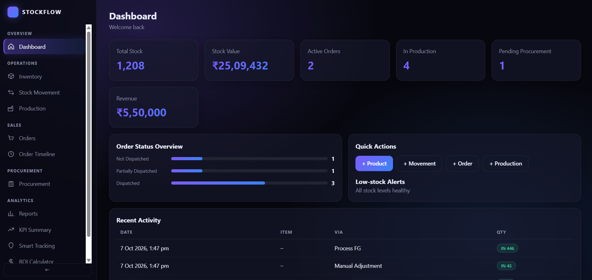

A full-stack inventory and business operations management system built with HTML, CSS, JavaScript, Node.js, Express.js, and MongoDB.

Smart StockFlow ERP provides a centralized dashboard for managing inventory, stock movements, production, orders, procurement, reports, KPI tracking, smart tracking, and ROI analysis.

## 🚀 Features

- 📊 Modern ERP-style dashboard
- 📦 Inventory management
- 🔄 Stock movement tracking
- 🏭 Production management
- 💰 Production costing
- 🧾 Sales and purchase order management
- ⏱️ Order timeline tracking
- 🛒 Procurement management
- 📈 Reports and analytics
- 📊 KPI summary
- 📍 Smart tracking
- 💵 ROI calculator
- 🗄️ MongoDB database integration
- 🔌 REST API using Express.js
- 🎨 Modern responsive user interface
- 🔄 Real database-backed data

## 📸 Demo



## 🛠️ Technology Stack

### Frontend

- HTML5
- CSS3
- Vanilla JavaScript

### Backend

- Node.js
- Express.js

### Database

- MongoDB
- Mongoose
## 🏗️ System Architecture

```text
┌──────────────────────────────┐
│        Web Browser           │
│     HTML / CSS / JavaScript  │
└──────────────┬───────────────┘
               │
               │ Fetch API
               ▼
┌──────────────────────────────┐
│       Express.js Server      │
│          REST APIs            │
└──────────────┬───────────────┘
               │
               │ Mongoose
               ▼
┌──────────────────────────────┐
│          MongoDB             │
│       Persistent Data        │
└──────────────────────────────┘## 🏗️ System Architecture

```text
┌──────────────────────────────┐
│        Web Browser           │
│     HTML / CSS / JavaScript  │
└──────────────┬───────────────┘
               │
               │ Fetch API
               ▼
┌──────────────────────────────┐
│       Express.js Server      │
│          REST APIs            │
└──────────────┬───────────────┘
               │
               │ Mongoose
               ▼
┌──────────────────────────────┐
│          MongoDB             │
│       Persistent Data        │
└──────────────────────────────┘

📁 Project Structure
smart-stockflow-erp/
│
├── frontend/
│   ├── index.html
│   ├── dashboard.html
│   └── tour.html
│
├── css/
│   ├── app.css
│   ├── style.css
│   ├── dashboard.css
│   └── responsive.css
│
├── js/
│   ├── app.js
│   ├── main.js
│   └── page-specific JavaScript files
│
├── backend/
│   ├── server.js
│   ├── config/
│   ├── models/
│   ├── routes/
│   └── controllers/
│
├── seed/
│   └── seed.js
│
├── package.json
├── .gitignore
└── README.md

📌 Main Modules
Dashboard
Provides an overview of important business information through summary cards, statistics, and management sections.
Inventory
Manage products and monitor:
- Product details
- Stock quantity
- Minimum stock levels
- Unit prices
- Selling prices
- Stock valuation
Stock Movement
Track stock entering and leaving the inventory.
The system records stock movement information and updates inventory quantities.
Production
Manage production records and monitor production status and costing.
Orders
Manage sales and purchase orders with order status and relevant details.
Order Timeline
Track the progress of individual orders through their different stages.
Procurement
Manage procurement-related information and purchasing operations.
Reports
Provides business reports and categorized information for analysis.
KPI Summary
Displays important business performance indicators using available system data.
Smart Tracking
Provides a centralized view for tracking important operational information.
ROI Calculator
Calculates potential business savings and return on investment based on entered values.
🗄️ Database
MongoDB is used as the primary database and Mongoose is used to communicate with MongoDB from the Node.js backend.
The system stores information related to:
- Users
- Products
- Stock movements
- Production
- Orders
- Order timelines
- Reports
- Approvals
- Roles
- Procurement
- Reminders
⚙️ Installation
1. Clone the repository
git clone https://github.com/dwarakeshgit/smart-stockflow-erp.git

2. Open the project
cd smart-stockflow-erp

3. Install dependencies
npm install

4. Configure MongoDB
Create a .env file in the project root.
MONGO_URI=your_mongodb_connection_string
PORT=5000

Do not upload the .env file to GitHub.
5. Seed the database
npm run seed

The seed process creates sample data for testing the application.
6. Start the application
npm start

The server will run at:
http://localhost:5000

Open the address in your browser.
🔄 How the System Works
The application follows this basic flow:
User
  ↓
Frontend
  ↓
JavaScript Fetch API
  ↓
Express REST API
  ↓
Controller
  ↓
Mongoose
  ↓
MongoDB

For example, when a product is added:
Add Product
     ↓
Frontend Form
     ↓
POST API Request
     ↓
Express Route
     ↓
Product Controller
     ↓
Mongoose
     ↓
MongoDB

The stored information can then be retrieved and displayed again from the database.
🔌 API
The backend provides REST APIs for the major modules of the application.
Examples include:
/api/products
/api/stock-movements
/api/production
/api/orders
/api/reports
/api/dashboard/summary

The frontend communicates with these APIs using JavaScript fetch() requests.
🧪 Testing
The system can be tested by performing operations such as:
- Adding products
- Editing products
- Deleting products
- Viewing inventory
- Recording stock movements
- Creating production records
- Updating production status
- Creating orders
- Updating order status
- Viewing order timelines
- Viewing reports
- Checking dashboard statistics
- Using the ROI calculator
After modifying database data, refreshing the page verifies that the information is persistently stored in MongoDB.
🎯 Project Objective
The objective of Smart StockFlow ERP is to create a centralized system for managing important business operations.
Instead of maintaining inventory, production, orders, procurement, and reports separately, the system brings these functions together into one web-based platform.
💡 Advantages
- Centralized business management
- Real database storage
- Reduced manual data management
- Easy inventory monitoring
- Better stock visibility
- Production tracking
- Order monitoring
- Business reporting
- Improved decision making
- Modular backend architecture
🔮 Future Enhancements
Possible future improvements include:
- User authentication and login
- Role-based access control
- Advanced dashboard analytics
- Email notifications
- Procurement reminders
- File/document uploads
- Advanced search and filtering
- Pagination for large datasets
- Export reports to PDF/Excel
- Cloud deployment
👨‍💻 Developer